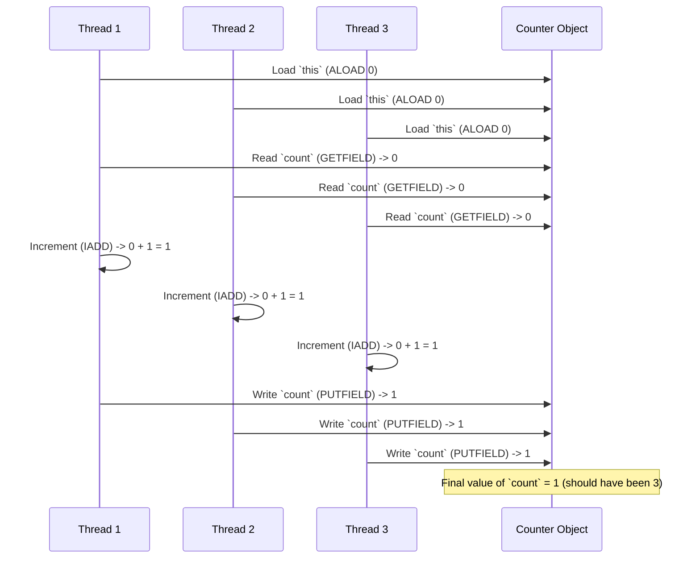
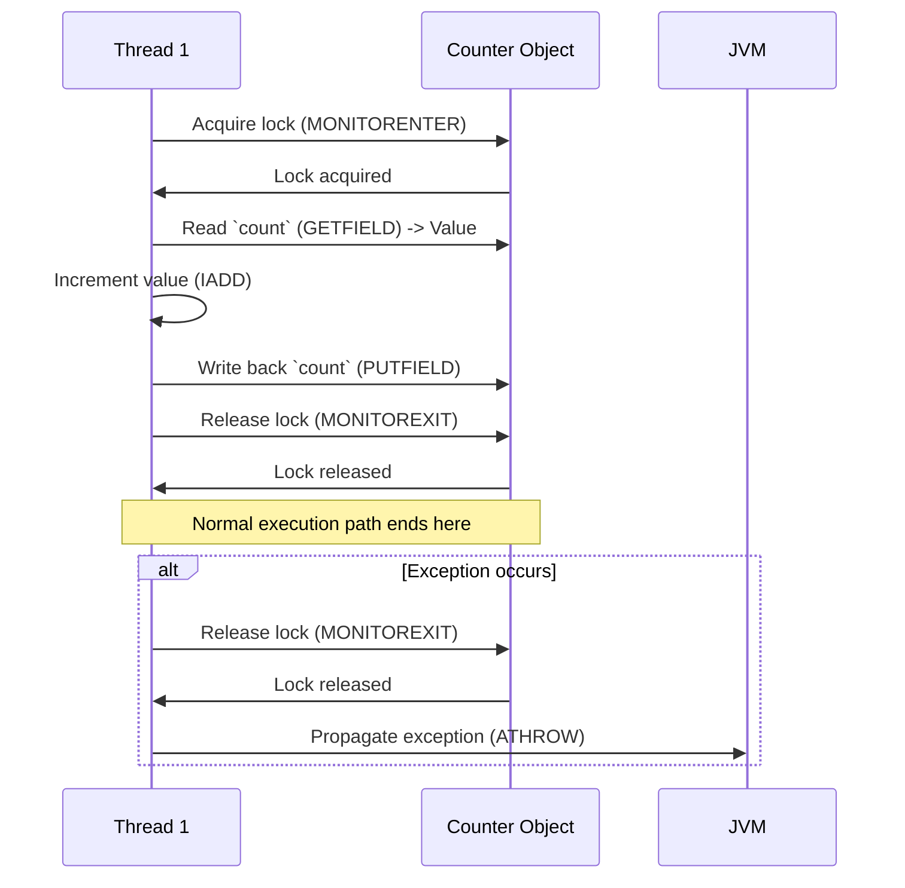
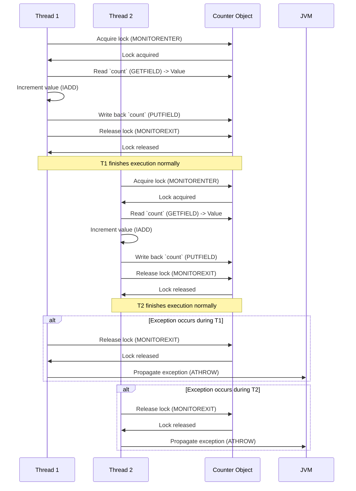
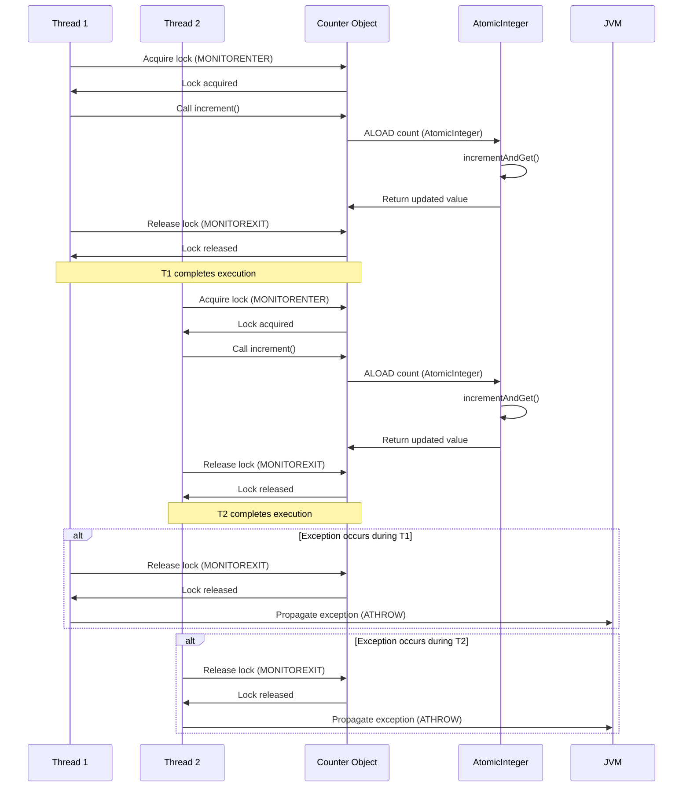

# Concurrency Basics

This point is key:
As soon as you scale your system or have several servers running you can no longer store state between them if that
state is purely inside them.
You need to use an external data store. then the operations become i/o because we are querying a database.

scheduler on Java

tasks run inside a thread

scheduler takes the tasks and moves them between the threads

Java 21 scheduler uses virtual threads

Takes tasks and maps the virtual threads to virtual threads and platform threads

Async frameworks can be helpful. You can use Futures which come with schedulers

Sequencing - one thing happening after another
Non concurrent = series of instructions

Completeable future:

```java
import java.util.concurrent.CompletableFuture;

private CompletableFuture<int> retry(CompletableFuture<int> fut) {
    // return ...
}
```

Recipe

- Reasoning on paper
    - no shared state
    - identify side effects
    - functional programming
- Tech
    - schedulers
- composable model
    - easy to maintain
    - easy to reason

Future - handle to event that has already started.

### increment:

The thread-safety issue in your code arises because the `increment` method is **not atomic**, meaning it consists of
multiple steps that can be interrupted by other threads. Let's map the issue to the bytecode of `increment()` to see how
it plays out:

---

### 1. **Understanding the Non-Atomic Bytecode Operations**

Here is the bytecode for the `increment` method again:

```java
increment()V

L0
ALOAD 0                               // Load 'this' onto the stack
DUP                                   // Duplicate 'this' (needed for both GETFIELD and PUTFIELD)
GETFIELD com/example/demo/Counter.count :
I   // Fetch the value of 'count'
        ICONST_1                              // Push the constant 1 onto the stack
IADD                                  // Add 1 to the fetched value of 'count'
PUTFIELD com/example/demo/Counter.count :
I   // Store the new value back into 'count'
        L1
RETURN                                // Return from the method
```

---

### 2. **Breakdown of Operations in a Multithreaded Context**

The above steps are **not thread-safe** because they are not executed as a single atomic operation. In a multithreaded
scenario, these steps can be interleaved between threads. Here's an example:

#### Scenario:

- **Initial state:** `count = 0`.
- **Two threads (Thread 1 and Thread 2)** are incrementing the `count` field.

#### Step-by-Step Interleaving:

| Time | Thread 1                        | Thread 2                        | Value of `count`    |
|------|---------------------------------|---------------------------------|---------------------|
| T1   | `ALOAD 0`                       |                                 | 0                   |
| T2   |                                 | `ALOAD 0`                       | 0                   |
| T3   | `DUP`                           |                                 | 0                   |
| T4   |                                 | `DUP`                           | 0                   |
| T5   | `GETFIELD count` -> fetches `0` |                                 | 0                   |
| T6   |                                 | `GETFIELD count` -> fetches `0` | 0                   |
| T7   | `ICONST_1`                      |                                 | 0                   |
| T8   | `IADD` -> computes `0 + 1 = 1`  |                                 | 0                   |
| T9   |                                 | `ICONST_1`                      | 0                   |
| T10  |                                 | `IADD` -> computes `0 + 1 = 1`  | 0                   |
| T11  | `PUTFIELD count` -> writes `1`  |                                 | **1**               |
| T12  |                                 | `PUTFIELD count` -> writes `1`  | **1** (overwrites!) |

#### Result:

Both threads incremented the value, but the final result is `1` instead of `2`.

---

### 3. **Why This Happens**

The root cause is that `increment()` involves **multiple steps**:

1. Reading the current value of `count`.
2. Incrementing the value.
3. Writing the incremented value back to `count`.

In a multithreaded environment, these steps are not executed as a single, indivisible (atomic) operation. Thus, one
thread can interrupt another thread between these steps, leading to **race conditions**.

---

### 4. **How to Fix It**

#### Option 1: Use `synchronized`

Make the `increment` method thread-safe by using the `synchronized` keyword:

```java
class Counter {
    private int count;

    synchronized void increment() {
        count++;
    }

    int getCount() {
        return count;
    }
}
```

The `synchronized` keyword ensures that only one thread can execute `increment()` at a time, thus preventing race
conditions.

#### Option 2: Use `AtomicInteger`

Replace `Counter` with `java.util.concurrent.atomic.AtomicInteger`:

```java
import java.util.concurrent.atomic.AtomicInteger;

class Counter {
    private AtomicInteger count = new AtomicInteger();

    void increment() {
        count.incrementAndGet();
    }

    int getCount() {
        return count.get();
    }
}
```

`AtomicInteger` provides thread-safe atomic operations like `incrementAndGet` that guarantee correctness without
requiring `synchronized`.

---

### 5. **How to Relate to Bytecode**

- With **synchronized**:
  The JVM will generate additional monitor instructions (`MONITORENTER` and `MONITOREXIT`) around the method, ensuring
  only one thread accesses it at a time.

- With **AtomicInteger**:
  The bytecode will invoke native methods (using `sun.misc.Unsafe`) that handle atomic updates at the hardware level,
  ensuring atomicity even with multiple threads.

---

### 6. **Validation**

Run your code again after applying one of the fixes (`synchronized` or `AtomicInteger`). The final output should always
be **20000** (10,000 increments from each thread) instead of an inconsistent or lower number.

Would you like me to explain how `AtomicInteger` achieves atomicity internally?

Let’s consider the scenario with **100 threads**, each performing 1000 increments. This means the total increments
expected should be:

\[
100 \times 1000 = 100,000
\]

However, due to the **non-atomic nature of `count++`**, race conditions will likely lead to a lower final value. Here's
how the interleaving could occur in such a setup:

---

### **Setup**

- **Threads**: 100
- **Iterations per thread**: 1000
- **Shared resource**: `Counter.count`

---

### **Interleaving Example with 100 Threads**

We'll illustrate how threads interfere with each other while updating `count`. To simplify, assume `count = 0` at the
start. We'll simulate an interleaving involving just 3 threads (`T1`, `T2`, and `T3`), but the same issues would scale
to 100 threads.

#### **Initial State**

- `count = 0`

#### **Thread Execution**

Each thread follows these bytecode steps for `count++`:

1. Load `count` (current value).
2. Increment `count`.
3. Store the new value back in `count`.

#### **Interleaved Steps**

| Step | Thread Action            | `count` (Observed Value) | Explanation                               |
|------|--------------------------|--------------------------|-------------------------------------------|
| T1   | `ALOAD 0` (loads `this`) | 0                        | Thread 1 starts incrementing.             |
| T2   | `ALOAD 0` (loads `this`) | 0                        | Thread 2 starts before Thread 1 finishes. |
| T3   | `ALOAD 0` (loads `this`) | 0                        | Thread 3 starts as well.                  |
| T1   | `GETFIELD count` -> `0`  | 0                        | Thread 1 reads `count`.                   |
| T2   | `GETFIELD count` -> `0`  | 0                        | Thread 2 reads `count` (still 0).         |
| T3   | `GETFIELD count` -> `0`  | 0                        | Thread 3 reads `count`.                   |
| T1   | `ICONST_1`               | 0                        | Thread 1 prepares to add 1.               |
| T1   | `IADD` -> `0 + 1 = 1`    | 0                        | Thread 1 computes the new value.          |
| T2   | `ICONST_1`               | 0                        | Thread 2 prepares to add 1.               |
| T2   | `IADD` -> `0 + 1 = 1`    | 0                        | Thread 2 computes the new value.          |
| T3   | `ICONST_1`               | 0                        | Thread 3 prepares to add 1.               |
| T3   | `IADD` -> `0 + 1 = 1`    | 0                        | Thread 3 computes the new value.          |
| T1   | `PUTFIELD count` -> `1`  | **1**                    | Thread 1 writes `1` to `count`.           |
| T2   | `PUTFIELD count` -> `1`  | **1**                    | Thread 2 overwrites `count` with `1`.     |
| T3   | `PUTFIELD count` -> `1`  | **1**                    | Thread 3 overwrites `count` with `1`.     |

---

### **Result After One Iteration**

Even though three threads incremented `count`, the final value is still `1` because each thread overwrote the previous
value. This illustrates a **race condition**.

---

### **Scaling Up to 100 Threads**

With 100 threads running concurrently, this interleaving happens repeatedly. As threads interfere with each other:

1. Many increments are **lost** due to overwriting.
2. The final `count` will often be **far less than the expected 100,000**.

For example:

- Suppose only one thread successfully updates `count` per set of 3 interleavings. This leads to:
  \[
  100 \times 1000 / 3 = \text{~33,333 updates instead of 100,000.}
  \]
- The actual value will vary, but it will always be **less than 100,000** unless thread safety is enforced.

---

### **Fix with Thread Safety**

#### **Using `synchronized`**

Every thread will increment sequentially without interference:

1. Thread 1 increments `count` to 1.
2. Thread 2 increments `count` to 2.
3. ...
4. Thread 100 increments `count` to 100,000.

This guarantees the final value is `100,000`.

#### **Using `AtomicInteger`**

`AtomicInteger.incrementAndGet()` ensures atomicity, making each thread-safe update equivalent to the synchronized
version, and the final value will also be `100,000`.

Would you like me to simulate or implement a version with thread-safe counters to confirm the fix?



When the `synchronized` keyword is added to the `increment` method, the generated bytecode differs because the JVM adds
**monitoring instructions** (`MONITORENTER` and `MONITOREXIT`) to ensure mutual exclusion. These instructions handle
locking and unlocking for thread safety.

Here’s how the bytecode changes with `synchronized`:

---

### **Without `synchronized`**

```java
increment()V

L0
LINENUMBER 7 L0
ALOAD 0
DUP
GETFIELD com/example/demo/Counter.count :
I
        ICONST_1
IADD
PUTFIELD com/example/demo/Counter.count :
I
        L1
LINENUMBER 8
L1
        RETURN
L2
LOCALVARIABLE this Lcom/example/demo/Counter;
L0 L2 0
MAXSTACK =3
MAXLOCALS =1
```

---

### **With `synchronized`**

When `synchronized` is added to `increment`, the bytecode changes as follows:

```java
synchronized increment()V

L0
LINENUMBER 7 L0
ALOAD 0
MONITORENTER                           // Acquires the monitor lock for 'this'
ALOAD 0
DUP
GETFIELD com/example/demo/Counter.count :
I
        ICONST_1
IADD
PUTFIELD com/example/demo/Counter.count :
I
        L1
LINENUMBER 8 L1
ALOAD 0
MONITOREXIT                            // Releases the monitor lock for 'this'
        RETURN
L2
ASTORE 1                               // Handles exceptions (see below)
L3
ALOAD 0
MONITOREXIT                            // Ensures the lock is released even if an exception occurs
        L4
ATHROW                                 // Re-throws the exception
        L5
LOCALVARIABLE this Lcom/example/demo/Counter;
L0 L5 0
MAXSTACK =3
MAXLOCALS =2
```

---

### **Key Differences**

1. **`MONITORENTER`**:

- This instruction is added at the start of the method.
- It locks the `this` object (or the specified monitor object) to prevent other threads from entering the synchronized
  block until the lock is released.

2. **`MONITOREXIT`**:

- Added before the `RETURN` statement.
- It releases the lock to allow other threads to access the synchronized block.

3. **Exception Handling**:

- The `synchronized` method adds additional bytecode for exception safety:
    - If an exception occurs, the `MONITOREXIT` instruction ensures that the lock is released before the exception
      propagates.
    - The `ASTORE`, `ALOAD`, and `ATHROW` instructions handle this cleanup.

4. **Local Variables**:

- A new local variable is added (in this case, index 1) to store the exception temporarily.

---

### Why These Changes Are Important

- **Thread Safety**: The `MONITORENTER` and `MONITOREXIT` instructions ensure that only one thread can execute
  the `increment` method at a time on the same object.
- **Deadlock Prevention**: The additional exception handling ensures the lock is always released, even if an exception
  occurs, preventing potential deadlocks.



Two threads:



When using `AtomicInteger` in your Java program, the bytecode changes in several significant ways compared to using a
primitive `int`. The main differences arise from the thread-safe nature of `AtomicInteger` and its built-in atomic
operations. Let’s break down the changes based on the bytecode you provided.

### Key Differences Between `int` and `AtomicInteger` in the Bytecode

#### **1. Type of the Field**

- **Primitive `int`:** The `count` field in your initial example was of type `int`, a primitive type.
- **`AtomicInteger`:** In the updated example, the field is now of type `AtomicInteger`, which is an object, not a
  primitive.

Bytecode:

- **Before (`int`):**
  ```java
  private int count;
  ```

- **After (`AtomicInteger`):**
  ```java
  private Ljava/util/concurrent/atomic/AtomicInteger; count;
  ```

The field is now an object reference (`L` denotes an object type in bytecode), pointing to an instance
of `AtomicInteger`.

#### **2. The `increment()` Method**

In the original code, the `increment()` method directly modified the `count` field by adding 1. However,
with `AtomicInteger`, we leverage the `incrementAndGet()` method, which is an atomic operation designed for thread-safe
increments.

##### **Without `AtomicInteger` (Primitive `int`):**

```java
increment()V

L0
LINENUMBER 7 L0
ALOAD 0
DUP
GETFIELD com/example/demo/Counter.count :
I
        ICONST_1
IADD
PUTFIELD com/example/demo/Counter.count :
I
        L1
LINENUMBER 8
L1
        RETURN
```

##### **With `AtomicInteger` (`incrementAndGet()`):**

```java
synchronized increment()V

L0
LINENUMBER 9 L0
ALOAD 0
GETFIELD com/example/demo/Counter.count :Ljava/util/concurrent/atomic/AtomicInteger;
INVOKEVIRTUAL java/util/concurrent/atomic/AtomicInteger.

incrementAndGet()I

POP
        L1
LINENUMBER 10
L1
        RETURN
```

- **Explanation**:
    - `GETFIELD` retrieves the `AtomicInteger` instance (`count` field).
    - `INVOKEVIRTUAL java/util/concurrent/atomic/AtomicInteger.incrementAndGet ()I` calls the `incrementAndGet()` method
      of `AtomicInteger`. This is an atomic operation that increments the value and returns the new value.
    - `POP` removes the result of `incrementAndGet()` from the stack since it's not used (the method doesn't need to
      return a value).

In contrast to the primitive `int` approach (where the increment was manually done with `IADD`), the `AtomicInteger`
method handles the increment safely across threads.

#### **3. Synchronization**

The `increment()` method is marked as `synchronized`, which ensures mutual exclusion. This is in contrast to the
approach with `int`, where synchronization is not used.

- **Before (`int`):**
  No synchronization was applied to the `increment()` method, meaning multiple threads could modify the `count` field
  concurrently without synchronization.

- **After (`AtomicInteger`):**
  The method is explicitly synchronized, so only one thread can execute `increment()` at a time, ensuring that
  the `AtomicInteger` is accessed safely.

The `synchronized` keyword ensures that even though `AtomicInteger` provides atomic operations, the actual method
execution, including getting the field and calling the `incrementAndGet()` method, is done atomically with respect to
other threads.

#### **4. `getCount()` Method**

The `getCount()` method retrieves the current value of `count`.

##### **Without `AtomicInteger` (Primitive `int`):**

```java
getCount()I

L0
LINENUMBER 11 L0
ALOAD 0
GETFIELD com/example/demo/Counter.count :
I
        IRETURN
```

##### **With `AtomicInteger` (`get()`):**

```java
getCount()I

L0
LINENUMBER 13 L0
ALOAD 0
GETFIELD com/example/demo/Counter.count :Ljava/util/concurrent/atomic/AtomicInteger;
INVOKEVIRTUAL java/util/concurrent/atomic/AtomicInteger.

get()I

IRETURN
```

- **Explanation**:
    - Instead of directly returning the `count` value (which is a primitive `int`), the method now calls `get()` on
      the `AtomicInteger` instance to retrieve the current value. The `get()` method of `AtomicInteger` is thread-safe
      and atomic, ensuring that the correct value is always returned even in multi-threaded environments.

---

### Summary of Changes in Bytecode:

1. **Field Type**:

- The field `count` is now of type `AtomicInteger` instead of `int`, which requires reference-based operations rather
  than direct value manipulation.

2. **Increment Method**:

- The `increment()` method now uses the `AtomicInteger.incrementAndGet()` method to atomically increment the value,
  compared to manually manipulating the `int` field with `IADD`.

3. **Synchronization**:

- The `increment()` method is marked as `synchronized`, ensuring mutual exclusion. This could be seen as redundant when
  using `AtomicInteger` for thread-safe operations, but the synchronization ensures the method execution is atomic.

4. **Get Method**:

- The `getCount()` method retrieves the value using `AtomicInteger.get()`, which is a thread-safe way of reading the
  value.

In conclusion, using `AtomicInteger` simplifies the handling of concurrent access to shared variables because it
provides atomic methods like `incrementAndGet()`. However, adding `synchronized` still ensures that the entire method is
thread-safe, even if the atomicity of `AtomicInteger` already provides a level of thread safety for individual
operations.



### Seven Deadly sins of Concurrency

https://www.youtube.com/watch?v=-E4q1CZg-Jw

- Deadlock / Race condition examples of where code does different things to what expect in concurrent systems
- "As humans, we have a very limited capacity for simultaneous thought" Earl Miller Professor of Neuroscience at MIT

7 sins:

1. Using alien threads for non-trivial business logic
2. Not controlling the number of threads
3. Locking unnecessarily on a large scope
4. Mixing business logic with threading concerns
5. Locking on mutable shared state (illusion of parallelism)
6. Settling for a low-level solution
7. Neglecting error handling and troubleshooting

### Threads at Scale - Daniel Spiewak

https://www.youtube.com/watch?v=PLApcas04V0

### Race Conditions

https://www.youtube.com/watch?v=RMR75VzYoos

- Race condition is a situation where
    - two or more threads access the same variable (or data) in a way where the final result stored in the variable
      depends
      on how thread access to the variables is scheduled.
- Race conditions occur when
    - two or more threads read and write the same variables or data concurrently
    - the threads access the variables using either of these patterns
        - check then act
        - read modify write
            - where the modified value depends on the previously read value
    - The thread access to the variables or data is not atomic


```java

public void increment() {
    voteCount++; // critical section
}
```

Make the critical section atomic - only one thread can execute within the critical section at a time.
Sequential access to the critical section. Force the behaviour to be sequential.


The synchronized block makes the critical section atomic.

In Java (and in multithreaded programming in general), a **race condition** and a **visibility problem** are both
related to concurrency issues, but they refer to different concepts. Let's break down the differences:

### 1. **Race Condition**

A **race condition** occurs when multiple threads access shared data concurrently, and at least one of the threads
modifies the data, leading to unpredictable results or behaviors.

- **Cause:** This happens when there is **uncontrolled access** to shared resources (e.g., variables or data structures)
  by multiple threads, and the outcome depends on the **timing or sequence of execution** of the threads.
- **Result:** The program’s behavior is dependent on which thread finishes first, leading to inconsistent or incorrect
  results.
- **Example:**
    ```java
    class Counter {
        private int count = 0;
        
        public void increment() {
            count++;  // Read, increment, write back
        }
        
        public int getCount() {
            return count;
        }
    }
    ```
  In the example above, if multiple threads call `increment()`, the value of `count` might not be correctly incremented
  because the operations are not atomic. Thread 1 and Thread 2 could read the value of `count`, both increment it, and
  then write back the same value, effectively "losing" one increment.

    - **Fix for Race Condition:** You can synchronize the method using `synchronized`, or use other mechanisms
      like `AtomicInteger` or `Locks` to ensure proper synchronization.
      ```java
      synchronized void increment() {
          count++;
      }
      ```

### 2. **Visibility Problem**

A **visibility problem** occurs when one thread **modifies a shared variable**, but other threads do not immediately see
the updated value. This issue is often related to how variables are cached by threads or the processor, causing threads
to operate on stale or outdated data.

- **Cause:** Each thread may have its own **local cache** of variables, and changes made by one thread may not be
  immediately visible to other threads, leading to inconsistent or outdated values.
- **Result:** The other threads may continue to work with the old value of the variable, which leads to unpredictable
  behavior.
- **Example:**
    ```java
    class VisibilityExample {
        private boolean flag = false;
        
        public void changeFlag() {
            flag = true;
        }
        
        public void checkFlag() {
            if (flag) {
                System.out.println("Flag is true!");
            }
        }
    }
    ```
  If one thread updates `flag` and another thread checks it, the second thread might not see the updated value of `flag`
  due to the caching mechanism of modern processors or the JVM’s optimizations.

    - **Fix for Visibility Problem:** You can use `volatile` keyword to ensure that the variable is always read from and
      written to the main memory (not cached locally by threads), ensuring visibility across threads.
      ```java
      private volatile boolean flag = false;
      ```

### Key Differences:

| Aspect           | Race Condition                                                                                           | Visibility Problem                                                                                                            |
|------------------|----------------------------------------------------------------------------------------------------------|-------------------------------------------------------------------------------------------------------------------------------|
| **Definition**   | Occurs when multiple threads access shared data concurrently, and at least one thread modifies the data. | Occurs when a thread does not see the most recent changes made by another thread due to local caching or other optimizations. |
| **Cause**        | Lack of synchronization leading to conflicting updates.                                                  | Lack of proper visibility guarantees between threads.                                                                         |
| **Problem Type** | Logical error in program behavior due to timing issues.                                                  | Stale or outdated data being read by a thread.                                                                                |
| **Fix**          | Synchronize access to shared resources.                                                                  | Use `volatile` keyword, or employ synchronization mechanisms like `synchronized` blocks.                                      |

### Example Scenarios:

- **Race Condition:** Two threads increment a counter at the same time without proper synchronization. The final result
  is incorrect because both threads might read and write the same value without coordination.
- **Visibility Problem:** One thread updates a shared `boolean` flag, but another thread does not immediately see the
  updated value because the JVM is caching the flag in the local memory of the second thread.

### Summary:

- **Race condition** deals with the **order** of operations and how threads interact with each other, while **visibility
  problem** deals with whether threads can see the most up-to-date state of shared variables.

One thread reading one thread counting. Is an example of a visibility problem.
Race condition not see each other's updates. There is only one thread making updates.


Two Types of Race Conditions
Race conditions can occur when two or more threads read and write the same variable according to one of these two patterns:

Read-modify-write
Check-then-act
The read-modify-write pattern means, that two or more threads first read a given variable, then modify its value and write it back to the variable. For this to cause a problem, the new value must depend one way or another on the previous value. The problem that can occur is, if two threads read the value (into CPU registers) then modify the value (in the CPU registers) and then write the values back. This situation is explained in more detail later.

The check-then-act pattern means, that two or more threads check a given condition, for instance if a Map contains a given value, and then go on to act based on that information, e.g. taking the value from the Map. The problem may occur if two threads check the Map for a given value at the same time - see that the value is present - and then both threads try to take (remove) that value. However, only one of the threads can actually take the value. The other thread will get a null value back. This could also happen if a Queue was used instead of a Map.

Read-Modify-Write Critical Sections
As mentioned above, a read-modify-write critical section can lead to race conditions. In this section I will take a closer look at why that is. Here is a read-modify-write critical section Java code example that may fail if executed by multiple threads simultaneously:

public class Counter {

     protected long count = 0;

     public void add(long value){
         this.count = this.count + value;
     }
}
Imagine if two threads, A and B, are executing the add method on the same instance of the Counter class. There is no way to know when the operating system switches between the two threads. The code in the add() method is not executed as a single atomic instruction by the Java virtual machine. Rather it is executed as a set of smaller instructions, similar to this:

Read this.count from memory into register.
Add value to register.
Write register to memory.
Observe what happens with the following mixed execution of threads A and B:

       this.count = 0;

A:  Reads this.count into a register (0)
B:  Reads this.count into a register (0)
B:  Adds value 2 to register
B:  Writes register value (2) back to memory. this.count now equals 2
A:  Adds value 3 to register
A:  Writes register value (3) back to memory. this.count now equals 3
The two threads wanted to add the values 2 and 3 to the counter. Thus the value should have been 5 after the two threads complete execution. However, since the execution of the two threads is interleaved, the result ends up being different.

In the execution sequence example listed above, both threads read the value 0 from memory. Then they add their individual values, 2 and 3, to the value, and write the result back to memory. Instead of 5, the value left in this.count will be the value written by the last thread to write its value. In the above case it is thread A, but it could as well have been thread B.

Race Conditions in Read-Modify-Write Critical Sections
The code in the add() method in the example earlier contains a critical section. When multiple threads execute this critical section, race conditions occur.

More formally, the situation where two threads compete for the same resource, where the sequence in which the resource is accessed is significant, is called race conditions. A code section that leads to race conditions is called a critical section.

Check-Then-Act Critical Sections
As also mentioned above, a check-then-act critical section can also lead to race conditions. If two threads check the same condition, then act upon that condition in a way that changes the condition it can lead to race conditions. If two threads both check the condition at the same time, and then one thread goes ahead and changes the condition, this can lead to the other thread acting incorrectly on that condition.

To illustrate how a check-then-act critical section can lead to race conditions, look at the following example:
```java
public class CheckThenActExample {

    public void checkThenAct(Map<String, String> sharedMap) {
        if(sharedMap.containsKey("key")){
            String val = sharedMap.remove("key");
            if(val == null) {
                System.out.println("Value for 'key' was null");
            }
        } else {
            sharedMap.put("key", "value");
        }
    }
}
```

In  order to resolve the issue of the value sometimes incorrectly being null we have to make the operation atomic:
```java
public class CheckThenActExample {

    public void checkThenAct(Map<String, String> sharedMap) {
        synchronized (sharedMap) {
            if(sharedMap.containsKey("key")){
                String val = sharedMap.remove("key");
                if(val == null) {
                    System.out.println("Value for 'key' was null");
                }
            } else {
                sharedMap.put("key", "value");
            }
        }
       
    }
}
```


If two or more threads call the checkThenAct() method on the same CheckThenActExample object, then two or more threads may execute the if-statement at the same time, evaluate sharedMap.containsKey("key") to true, and thus move into the body code block of the if-statement. In there, multiple threads may then try to remove the key,value pair stored for the key "key", but only one of them will actually be able to do it. The rest will get a null value back, since another thread already removed the key,value pair.

Preventing Race Conditions
To prevent race conditions from occurring you must make sure that the critical section is executed as an atomic instruction. That means that once a single thread is executing it, no other threads can execute it until the first thread has left the critical section.

Race conditions can be avoided by proper thread synchronization in critical sections. Thread synchronization can be achieved using a synchronized block of Java code. Thread synchronization can also be achieved using other synchronization constructs like locks or atomic variables like java.util.concurrent.atomic.AtomicInteger.

Critical Section Throughput
For smaller critical sections making the whole critical section a synchronized block may work. But, for larger critical sections it may be beneficial to break the critical section into smaller critical sections, to allow multiple threads to execute each a smaller critical section. This may decrease contention on the shared resource, and thus increase throughput of the total critical section.

Here is a very simplified Java code example to show what I mean:

public class TwoSums {

    private int sum1 = 0;
    private int sum2 = 0;
    
    public void add(int val1, int val2){
        synchronized(this){
            this.sum1 += val1;   
            this.sum2 += val2;
        }
    }
}
Notice how the add() method adds values to two different sum member variables. To prevent race conditions the summing is executed inside a Java synchronized block. With this implementation only a single thread can ever execute the summing at the same time.

However, since the two sum variables are independent of each other, you could split their summing up into two separate synchronized blocks, like this:
```java

public class TwoSums {

    private int sum1 = 0;
    private int sum2 = 0;

    private Integer sum1Lock = new Integer(1);
    private Integer sum2Lock = new Integer(2);

    public void add(int val1, int val2){
        synchronized(this.sum1Lock){
            this.sum1 += val1;   
        }
        synchronized(this.sum2Lock){
            this.sum2 += val2;
        }
    }
}
```

Now two threads can execute the add() method at the same time. One thread inside the first synchronized block, and another thread inside the second synchronized block. The two synchronized blocks are synchronized on different objects, so two different threads can execute the two blocks independently. This way threads will have to wait less for each other to execute the add() method.

This example is very simple, of course. In a real life shared resource the breaking down of critical sections may be a whole lot more complicated, and require more analysis of execution order possibilities.

### Synchronized

Declaring instance method synchronized means only one thread can execute that method at a time on a given instance of that class.
Synchronized instance methods are always syncrhonized on the instance that the instance method refers to.
Syncrhonized blocks can be synchronized on any Java object you want to use as monitor object.


### Possible Plan
### **Talk Plan: Understanding and Resolving Race Conditions in Java**

---

#### **1. Introduction to Race Conditions**
- **Definition:**
    - A race condition arises when the behavior of a program depends on the interleaving of thread execution.
    - Occurs when two or more threads access shared data concurrently, with at least one thread modifying it.
- **Why It Matters:**
    - Can lead to unpredictable results, bugs, and performance issues.
    - Often hard to detect and reproduce due to thread execution timing.

---

#### **2. Anatomy of a Race Condition**
- **Root Causes:**
    - **Read-Modify-Write Pattern:** Threads read shared data, modify it, and write back, with outcomes depending on the order of execution.
    - **Check-Then-Act Pattern:** Threads check a condition, act on it, but the condition changes due to interleaved execution.

- **Example: Read-Modify-Write (Counter)**
  ```java
  class Counter {
      private int count = 0;

      public void increment() {
          count++;  // Read, modify, write
      }
  }
  ```
    - If two threads call `increment()` simultaneously, the count may be updated incorrectly.

- **Example: Check-Then-Act (Map Access)**
  ```java
  public void checkThenAct(Map<String, String> sharedMap) {
      if (sharedMap.containsKey("key")) {
          String val = sharedMap.remove("key");
          if (val == null) {
              System.out.println("Value for 'key' was null");
          }
      } else {
          sharedMap.put("key", "value");
      }
  }
  ```
    - Multiple threads may check the same condition and attempt conflicting actions.

---

#### **3. Key Symptoms and Diagnosis**
- **Inconsistent Results:** Outputs vary between program runs.
- **Stale Data Access (Visibility Problems):** Threads read outdated values due to local caching.
- **Thread Interleaving Complexity:** Bugs are timing-dependent and non-deterministic.

---

#### **4. Differences: Race Conditions vs. Visibility Problems**
| Aspect           | Race Condition                                       | Visibility Problem                                        |
|------------------|------------------------------------------------------|----------------------------------------------------------|
| **Definition**   | Conflicting thread updates to shared data.           | Threads not seeing updated values immediately.           |
| **Cause**        | Lack of synchronization on critical sections.        | Thread-local caching or lack of visibility guarantees.   |
| **Fix**          | Synchronize shared data access.                      | Use `volatile` or synchronization for visibility.        |

---

#### **5. Solutions to Race Conditions**

##### **A. Synchronization**
- **Using `synchronized` Blocks:**
    - Protect critical sections by ensuring only one thread can access them at a time.
  ```java
  public void increment() {
      synchronized (this) {
          count++;
      }
  }
  ```
- **Best Practices:**
    - Keep synchronized blocks minimal to reduce contention.
    - Avoid synchronizing on mutable objects (e.g., `StringBuffer`).

##### **B. Locks and Monitors**
- **Custom Lock Objects:**
    - Use fine-grained locking to increase throughput.
  ```java
  private final Object lock1 = new Object();
  private final Object lock2 = new Object();

  public void add(int val1, int val2) {
      synchronized (lock1) {
          sum1 += val1;
      }
      synchronized (lock2) {
          sum2 += val2;
      }
  }
  ```
- **Reentrant Locks:**
    - More flexible than `synchronized`, allowing try-locking and interruptible locks.

##### **C. Atomic Variables**
- Simplify thread-safe operations on single variables:
  ```java
  private AtomicInteger count = new AtomicInteger(0);

  public void increment() {
      count.incrementAndGet();
  }
  ```

---

#### **6. Handling Visibility Problems**
- **Using `volatile`:**
    - Guarantees visibility of updates to a variable across threads.
  ```java
  private volatile boolean flag = false;
  ```
- **Drawbacks:**
    - Doesn’t ensure atomicity; combine with other synchronization techniques when needed.

---

#### **7. Race Condition Patterns and Resolutions**

##### **Read-Modify-Write Critical Sections**
- **Problem:**
    - Multiple threads read, modify, and write back shared data.
- **Solution:**
    - Use `synchronized` or atomic variables for sequential execution.

##### **Check-Then-Act Critical Sections**
- **Problem:**
    - Multiple threads check a condition and act based on outdated assumptions.
- **Solution:**
    - Make the entire check-act process atomic using synchronization.

---

#### **8. Optimizing Throughput**
- **Avoid Lock Contention:**
    - Reduce the scope of synchronized blocks.
    - Use multiple locks for independent operations.

- **Example:**
  ```java
  public void add(int val1, int val2) {
      synchronized (lock1) {
          sum1 += val1;
      }
      synchronized (lock2) {
          sum2 += val2;
      }
  }
  ```

---

#### **9. Error Handling and Debugging**
- **Detecting Race Conditions:**
    - Use tools like thread analyzers and profilers (e.g., VisualVM, Java Mission Control).
    - Introduce logging in critical sections to track interleaving.

- **Debugging Tips:**
    - Reproduce issues under high concurrency with stress tests.
    - Use thread dumps to identify problematic execution patterns.

---

#### **10. Practical Guidelines for Safe Multithreading**
- **Control Thread Count:**
    - Use thread pools (e.g., `Executors.newFixedThreadPool`) to avoid oversubscription.
- **Avoid Mixing Business Logic with Threading Concerns:**
    - Use frameworks like `ForkJoinPool` or `CompletableFuture` for task management.
- **Use High-Level Concurrency Utilities:**
    - Leverage `java.util.concurrent` for thread-safe collections, locks, and synchronization aids.

---

#### **11. Conclusion**
- Race conditions and visibility problems can be subtle and hard to debug but are solvable with disciplined coding practices.
- Key Takeaways:
    - Understand and identify critical sections.
    - Use appropriate synchronization strategies for different scenarios.
    - Leverage modern Java concurrency utilities to reduce complexity and improve safety.

- End with a Q&A session to clarify doubts and explore additional use cases.


### Possible talk

### **Talk: Understanding and Resolving Race Conditions in Java**

---

#### **Slide 1: Title Slide**
```
# Understanding and Resolving Race Conditions in Java
### How to Make Multithreaded Code Safe and Predictable
```
- Subtitle: *"Prevent bugs, optimize performance, and write safe concurrent code"*
- Speaker name, event, and date.

---

#### **Slide 2: Introduction to Race Conditions**
```
# What Are Race Conditions?
## A Common Concurrency Pitfall
```
- **Definition:**
    - A race condition arises when threads access shared data concurrently and outcomes depend on execution timing.
- **Impact:**
    - Leads to unpredictable results, bugs, and performance degradation.
    - Difficult to detect and reproduce due to non-deterministic thread interleaving.

---

#### **Slide 3: Example of a Race Condition**
```
# Example: Race Condition in a Counter
```
**Code Example (Without Synchronization):**
```java
class Counter {
    private int count = 0;

    public void increment() {
        count++; // Read, modify, write
    }

    public int getCount() {
        return count;
    }
}
```
- **Problem:** Multiple threads increment the counter simultaneously, leading to incorrect results.

---

#### **Slide 4: Symptoms and Challenges**
```
# Symptoms of Race Conditions
```
- **Inconsistent Results:** Output varies between runs.
- **Hard to Debug:** Issues occur due to timing and are hard to reproduce.
- **Non-Deterministic Behavior:** Program behavior changes with thread scheduling.

---

#### **Slide 5: Two Key Problems in Multithreading**
```
# Race Conditions vs. Visibility Problems
```
| **Aspect**        | **Race Condition**                                       | **Visibility Problem**                                |
|--------------------|----------------------------------------------------------|------------------------------------------------------|
| **Definition**     | Conflicting thread updates to shared data.               | Threads not seeing updated values immediately.       |
| **Cause**          | Lack of synchronization on critical sections.            | Local thread caching or lack of visibility guarantees. |
| **Fix**            | Synchronize shared data access.                          | Use `volatile` or synchronization for visibility.    |

---

#### **Slide 6: Anatomy of a Race Condition**
```
# Understanding Race Conditions
```
- **Root Causes:**
    - **Read-Modify-Write:** Threads read shared data, modify it, and write back, leading to conflicts.
    - **Check-Then-Act:** Threads check a condition and act, but the condition changes due to interleaving.

---

#### **Slide 7: Read-Modify-Write Example**
```
# Race Condition: Read-Modify-Write
```
**Problem Code:**
```java
public class Counter {
    protected long count = 0;

    public void add(long value) {
        count = count + value; // Critical Section
    }
}
```
- **What Happens:**
    - Threads read `count` simultaneously, modify it in their registers, and overwrite each other’s updates.

---

#### **Slide 8: Fixing Read-Modify-Write**
```
# Solution: Synchronize Critical Sections
```
**Fixed Code:**
```java
public synchronized void add(long value) {
    count = count + value;
}
```
- **Effect:**
    - Ensures only one thread executes the critical section at a time.

---

#### **Slide 9: Check-Then-Act Example**
```
# Race Condition: Check-Then-Act
```
**Problem Code:**
```java
public void checkThenAct(Map<String, String> sharedMap) {
    if (sharedMap.containsKey("key")) {
        String val = sharedMap.remove("key");
        if (val == null) {
            System.out.println("Value for 'key' was null");
        }
    }
}
```
- **What Happens:**
    - Multiple threads may remove the same key, causing unexpected null values.

---

#### **Slide 10: Fixing Check-Then-Act**
```
# Solution: Synchronize the Check-Then-Act
```
**Fixed Code:**
```java
public void checkThenAct(Map<String, String> sharedMap) {
    synchronized (sharedMap) {
        if (sharedMap.containsKey("key")) {
            String val = sharedMap.remove("key");
            if (val == null) {
                System.out.println("Value for 'key' was null");
            }
        }
    }
}
```
- **Effect:**
    - Ensures that only one thread executes the check and act process at a time.

---

#### **Slide 11: Visibility Problems**
```
# Visibility Problems: Why Data Feels Stale
```
- **Definition:** One thread updates a variable, but other threads don’t see the updated value.
- **Cause:** Threads cache variables locally.
- **Solution:** Use the `volatile` keyword or synchronization.

---

#### **Slide 12: Solving Visibility Problems**
```
# Solution: Using `volatile`
```
**Example Code:**
```java
private volatile boolean flag = false;

public void updateFlag() {
    flag = true;
}

public void checkFlag() {
    if (flag) {
        System.out.println("Flag is true!");
    }
}
```
- **Effect:** Updates to `flag` are immediately visible to all threads.

---

#### **Slide 13: Optimizing Throughput**
```
# Advanced Synchronization: Splitting Locks
```
**Example Code:**
```java
private final Object lock1 = new Object();
private final Object lock2 = new Object();

public void add(int val1, int val2) {
    synchronized (lock1) {
        sum1 += val1;
    }
    synchronized (lock2) {
        sum2 += val2;
    }
}
```
- **Effect:** Allows different threads to work on independent data simultaneously, increasing throughput.

---

#### **Slide 14: Tools and Techniques**
```
# Debugging and Tools
```
- **Detect Race Conditions:**
    - Stress tests with high concurrency.
    - Use thread analyzers (e.g., VisualVM, Java Mission Control).
- **Best Practices:**
    - Minimize synchronized blocks.
    - Avoid locking on mutable objects.

---

#### **Slide 15: Conclusion**
```
# Takeaways
## Prevent Race Conditions, Write Safe Code
```
- Understand critical sections and shared data risks.
- Use proper synchronization (`synchronized`, `Locks`, `AtomicInteger`).
- Leverage modern Java concurrency utilities for safety and performance.
- **Final Thought:** Safe multithreading is a skill, not just a technique.

**Q&A Slide**: Open floor for questions.


### Possible article
## **Understanding and Resolving Race Conditions in Java**

Concurrency can unlock incredible performance and scalability in Java applications, but it comes with significant challenges. One of the most notorious pitfalls is **race conditions**—bugs caused by improper synchronization between threads. In this article, we’ll dive deep into what race conditions are, why they happen, and how to resolve them effectively.

---

### **What Are Race Conditions?**

A **race condition** occurs when multiple threads access shared data concurrently, and at least one thread modifies it, leading to unpredictable outcomes. The result depends on the sequence and timing of thread execution, which is non-deterministic and outside the programmer's control.

#### **Symptoms of Race Conditions**
- **Inconsistent results:** Program outputs differ across runs.
- **Hard-to-reproduce bugs:** Thread scheduling varies between executions.
- **Logical errors:** Application behavior deviates from expectations due to incorrect updates.

---

### **Two Key Problems in Multithreading**

Concurrency issues in Java often stem from two problems: **race conditions** and **visibility problems**. While related, these are distinct challenges:

| **Aspect**        | **Race Condition**                                       | **Visibility Problem**                                |
|--------------------|----------------------------------------------------------|------------------------------------------------------|
| **Definition**     | Conflicting thread updates to shared data.               | Threads not seeing updated values immediately.       |
| **Cause**          | Lack of synchronization on critical sections.            | Local thread caching or lack of visibility guarantees. |
| **Fix**            | Synchronize shared data access.                          | Use `volatile` or synchronization for visibility.    |

---

### **Root Causes of Race Conditions**

Race conditions generally occur due to improper handling of **critical sections**—parts of the code where shared resources are accessed or modified. Two common patterns that lead to race conditions are:

1. **Read-Modify-Write:**
    - Threads read shared data, modify it, and write back the result.
    - Example: Incrementing a shared counter without synchronization.

2. **Check-Then-Act:**
    - Threads check a condition and act based on it, but the condition may change due to interleaving threads.
    - Example: Checking for a key in a map and removing it simultaneously in different threads.

---

### **Example: Race Condition in a Counter**

Consider a simple counter that increments a shared variable:

```java
class Counter {
    private int count = 0;

    public void increment() {
        count++; // Read, modify, write
    }

    public int getCount() {
        return count;
    }
}
```

#### **What Happens?**
Multiple threads calling `increment()` simultaneously may lead to incorrect results because `count++` is not atomic. Here’s what happens under the hood:
1. Thread A reads `count` into its register (e.g., value = 0).
2. Thread B reads `count` at the same time (value = 0).
3. Thread A increments the value and writes 1 to memory.
4. Thread B increments its value and writes 1 to memory, **overwriting Thread A’s update.**

The expected final value (2) is lost due to this interleaving of thread operations.

---

### **Fixing Race Conditions**

#### **Solution 1: Synchronization**
One way to prevent race conditions is to synchronize access to critical sections. By using the `synchronized` keyword, you ensure that only one thread can execute the critical section at a time.

```java
public synchronized void increment() {
    count++;
}
```

This approach serializes access to the `increment()` method, guaranteeing correctness.

#### **Solution 2: Atomic Variables**
An alternative is to use atomic classes, such as `AtomicInteger`, which offer thread-safe operations without explicit synchronization.

```java
import java.util.concurrent.atomic.AtomicInteger;

class Counter {
    private AtomicInteger count = new AtomicInteger(0);

    public void increment() {
        count.incrementAndGet();
    }

    public int getCount() {
        return count.get();
    }
}
```

Atomic variables provide high performance and safety for simple operations like incrementing counters.

---

### **Example: Check-Then-Act Race Condition**

Consider the following example of a shared map:

```java
public void checkThenAct(Map<String, String> sharedMap) {
    if (sharedMap.containsKey("key")) {
        String val = sharedMap.remove("key");
        if (val == null) {
            System.out.println("Value for 'key' was null");
        }
    }
}
```

#### **What Happens?**
If two threads execute this method simultaneously:
1. Both threads check if `sharedMap` contains `"key"`.
2. Both proceed to remove the key-value pair.
3. One thread gets the correct value, while the other gets `null`.

---

#### **Solution: Synchronization**
Synchronizing the method ensures that only one thread can perform the check-and-act process at a time:

```java
public synchronized void checkThenAct(Map<String, String> sharedMap) {
    if (sharedMap.containsKey("key")) {
        String val = sharedMap.remove("key");
        if (val == null) {
            System.out.println("Value for 'key' was null");
        }
    }
}
```

---

### **Understanding Visibility Problems**

In multithreading, visibility problems occur when one thread updates a variable, but other threads don’t see the change immediately due to caching or optimization.

#### **Example: Flag Update**
```java
private boolean flag = false;

public void updateFlag() {
    flag = true;
}

public void checkFlag() {
    if (flag) {
        System.out.println("Flag is true!");
    }
}
```

#### **Problem:**
Thread A updates `flag`, but Thread B doesn’t see the updated value because it reads from a cached copy.

---

#### **Solution: Using `volatile`**
The `volatile` keyword ensures changes to a variable are visible across threads:

```java
private volatile boolean flag = false;
```

This guarantees that all threads access `flag` from main memory, avoiding stale values.

---

### **Optimizing Throughput**

Sometimes, synchronizing entire methods can be too restrictive, reducing concurrency. In such cases, you can optimize throughput by breaking locks into smaller critical sections.

#### **Example: Split Locks**
```java
private final Object lock1 = new Object();
private final Object lock2 = new Object();

public void add(int val1, int val2) {
    synchronized (lock1) {
        sum1 += val1;
    }
    synchronized (lock2) {
        sum2 += val2;
    }
}
```

Here, independent locks allow two threads to update `sum1` and `sum2` concurrently, improving performance.

---

### **Best Practices for Avoiding Race Conditions**

1. **Minimize Shared State:** Use local variables or immutable objects when possible.
2. **Use Higher-Level Concurrency Tools:**
    - Java’s `java.util.concurrent` package provides robust tools like `ConcurrentHashMap` and `ExecutorService`.
3. **Test Concurrent Code:** Stress-test multithreaded code under high contention.
4. **Avoid Over-Synchronization:** Locking unnecessarily large code blocks can degrade performance.

---

### **Conclusion**

Race conditions are a fundamental challenge in concurrent programming, but with the right tools and techniques, they can be effectively managed. By understanding critical sections, visibility issues, and synchronization strategies, you can write multithreaded code that is both correct and performant.

#### **Key Takeaways:**
- Identify and protect critical sections using synchronization or atomic variables.
- Use `volatile` for visibility issues.
- Optimize performance by breaking down locks and using modern concurrency utilities.

Mastering these concepts will help you build safe, scalable, and efficient Java applications.


### Accessing the heap at the same time


One update is now missing because each thread has updated the heap object at the same time


### Update visibility

also use volatile + synchronized to counter this problem

### Cache

cache can enable writes to be seen earlier by other CPUs. We don't have a guarantee of when register values will be written to the cache.

In order to be sure to avoid race conditions updates should be atomic using synchronized blocks, volatile or AtomicInteger etc.

### Single Tasking


### multi tasking


### Better application responsiveness


Nice quote
A Java thread is like a virtual CPU that can execute your code inside your Java application


### Atomic Versus Volatile
https://www.youtube.com/watch?v=31s_DzrkqZc

Atomic want a single unit to be able to do some work such as a thread reading or writing to a variable.
Volatile means expose visibility of changes to a value to different threads.

Volatile is a way of ensuring the JVM reads values from the heap as opposed to its local CPU thread cache.

This keyword does not ensure writes happen at particular times.
AtomicInteger ensures that writes to shared variables are threadsafe.

AtomicInteger is an object reference and we are not changing the value of the reference just the data underneath we don't
need volatile - we could use final. Final means immutable - immutability is the preference in concurrency because we only 
have to worry about data that is mutable with concurrency. The final keyword is better for object reference. If we were to 
make an object reference volatile that would mean we must be changing the object reference itself not the data that the object
reference points to.

### Semaphores in Java
https://www.youtube.com/watch?v=g19pjkJyGEU

A semaphore is the way to control the nubmer of threads that are going to access certain shared resource concurrently.
This is different from locks because with a lock you have a thread that waits for a lock gets it and then releases it when it's done.
With a semaphore the concept of actually locking a singular resource is decoupled from the number of resources that you are
trying to gain access to.

### Volatile to memory diagram


### Guarantee fairness:


```java
import java.util.concurrent.locks.ReentrantLock;

public class LockExample {
  public static void main(String[] args) {
    Lock lock = new ReentrantLock(true);

    lock.lock();

    lock.unlock();
  }
}
```

true (Fair lock): When the fairness parameter is set to true, the lock ensures that the longest-waiting thread will acquire the lock first. This means that threads will acquire the lock in the order in which they requested it, providing fairness among competing threads.

Fairness ensures that threads will not starve and will get a chance to acquire the lock if they are waiting for a long time.
The disadvantage of fairness is that it can introduce some overhead because the lock needs to track the order in which threads requested it.

### Differences between synchronized and locks
1. Synchronized must be contained within a single method. lock.lock() and lock.unlock() can be called from different methods.
2. lock.lock() and lock.unlock() provides the same visibility and happens before guarantees as entering and exiting a synchronized block
3. Synchronized blocks are always reentrant. Lock could decide not to be.
4. Synchronized blocks do not guarantee fairness. Locks can.

```java

    public void addVote(Vote vote) {

        try {
            lock.lock();
            proposals.stream()
                    .filter(p -> p.getId().equals(vote.getProposalId()))
                    .findFirst()
                    .ifPresent(Proposal::incrementVoteCount);
        } finally {
            lock.unlock();
        }
    }
```

### Deadlock


First thread one locks and thread 2 locks bottom. If Thread 1 and Thread 2 try the other's lock this will lead to a deadlock.


Other examples of threads blocking indefinitely:
- Livelock (trying to resolve the deadlock indefinitely)
- Nested monitor lockout
- reentrance lockout
- starvation


### Deadlock prevention and detection
- Lock reordering (quite simple ensure threads lock in the same order)
- timeout backoff (thread attempting to take lock times out and backs off lock attempting and other locks it has initiated)
- deadlock detection (detect deadlock before locking)

#### Detecting deadlocks


### Producer consumer pattern


The producer consumer pattern is a workload distribution pattern where the number of work executing threads is decoupled
from the number of tasks these worker threads are to execute.


