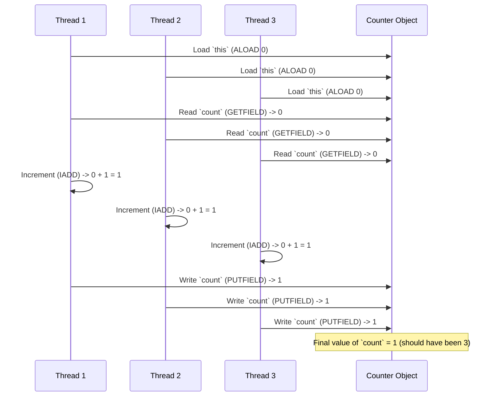
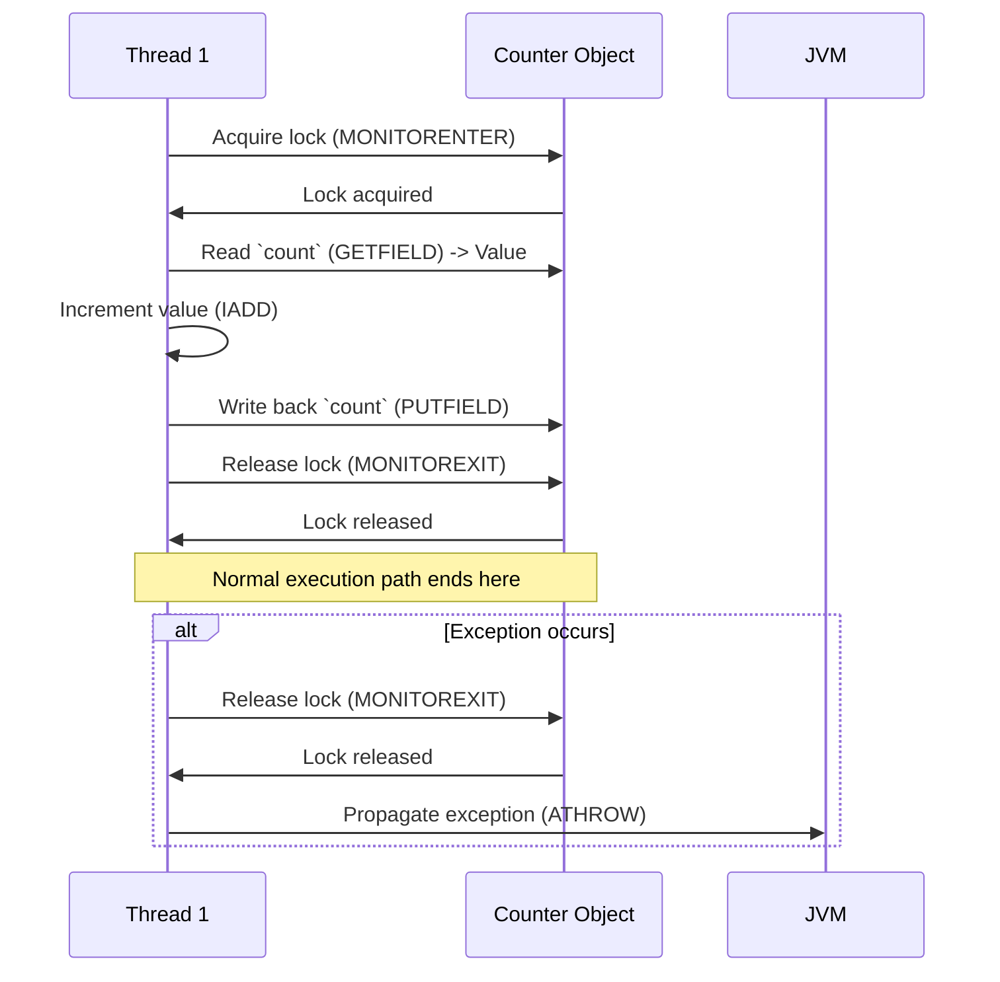

# debugging-concurrency

This point is key:
As soon as you scale your system or have several servers running you can no longer store state between them if that
state is purely inside them.
You need to use an external data store. then the operations become i/o because we are querying a database.

scheduler on Java

tasks run inside a thread

scheduler takes the tasks and moves them between the threads

Java 21 scheduler uses virtual threads

Takes tasks and maps the virtual threads to virtual threads and platform threads

Async frameworks can be helpful. You can use Futures which come with schedulers

Sequencing - one thing happening after another
Non concurrent = series of instructions

Completeable future:

```java
import java.util.concurrent.CompletableFuture;

private CompletableFuture<int> retry(CompletableFuture<int> fut) {
    // return ...
}
```

Recipe

- Reasoning on paper
    - no shared state
    - identify side effects
    - functional programming
- Tech
    - schedulers
- composable model
    - easy to maintain
    - easy to reason

Future - handle to event that has already started.

### increment:

The thread-safety issue in your code arises because the `increment` method is **not atomic**, meaning it consists of
multiple steps that can be interrupted by other threads. Let's map the issue to the bytecode of `increment()` to see how
it plays out:

---

### 1. **Understanding the Non-Atomic Bytecode Operations**

Here is the bytecode for the `increment` method again:

```java
increment()V

L0
ALOAD 0                               // Load 'this' onto the stack
DUP                                   // Duplicate 'this' (needed for both GETFIELD and PUTFIELD)
GETFIELD com/example/demo/Counter.count :
I   // Fetch the value of 'count'
        ICONST_1                              // Push the constant 1 onto the stack
IADD                                  // Add 1 to the fetched value of 'count'
PUTFIELD com/example/demo/Counter.count :
I   // Store the new value back into 'count'
        L1
RETURN                                // Return from the method
```

---

### 2. **Breakdown of Operations in a Multithreaded Context**

The above steps are **not thread-safe** because they are not executed as a single atomic operation. In a multithreaded
scenario, these steps can be interleaved between threads. Here's an example:

#### Scenario:

- **Initial state:** `count = 0`.
- **Two threads (Thread 1 and Thread 2)** are incrementing the `count` field.

#### Step-by-Step Interleaving:

| Time | Thread 1                        | Thread 2                        | Value of `count`    |
|------|---------------------------------|---------------------------------|---------------------|
| T1   | `ALOAD 0`                       |                                 | 0                   |
| T2   |                                 | `ALOAD 0`                       | 0                   |
| T3   | `DUP`                           |                                 | 0                   |
| T4   |                                 | `DUP`                           | 0                   |
| T5   | `GETFIELD count` -> fetches `0` |                                 | 0                   |
| T6   |                                 | `GETFIELD count` -> fetches `0` | 0                   |
| T7   | `ICONST_1`                      |                                 | 0                   |
| T8   | `IADD` -> computes `0 + 1 = 1`  |                                 | 0                   |
| T9   |                                 | `ICONST_1`                      | 0                   |
| T10  |                                 | `IADD` -> computes `0 + 1 = 1`  | 0                   |
| T11  | `PUTFIELD count` -> writes `1`  |                                 | **1**               |
| T12  |                                 | `PUTFIELD count` -> writes `1`  | **1** (overwrites!) |

#### Result:

Both threads incremented the value, but the final result is `1` instead of `2`.

---

### 3. **Why This Happens**

The root cause is that `increment()` involves **multiple steps**:

1. Reading the current value of `count`.
2. Incrementing the value.
3. Writing the incremented value back to `count`.

In a multithreaded environment, these steps are not executed as a single, indivisible (atomic) operation. Thus, one
thread can interrupt another thread between these steps, leading to **race conditions**.

---

### 4. **How to Fix It**

#### Option 1: Use `synchronized`

Make the `increment` method thread-safe by using the `synchronized` keyword:

```java
class Counter {
    private int count;

    synchronized void increment() {
        count++;
    }

    int getCount() {
        return count;
    }
}
```

The `synchronized` keyword ensures that only one thread can execute `increment()` at a time, thus preventing race
conditions.

#### Option 2: Use `AtomicInteger`

Replace `Counter` with `java.util.concurrent.atomic.AtomicInteger`:

```java
import java.util.concurrent.atomic.AtomicInteger;

class Counter {
    private AtomicInteger count = new AtomicInteger();

    void increment() {
        count.incrementAndGet();
    }

    int getCount() {
        return count.get();
    }
}
```

`AtomicInteger` provides thread-safe atomic operations like `incrementAndGet` that guarantee correctness without
requiring `synchronized`.

---

### 5. **How to Relate to Bytecode**

- With **synchronized**:
  The JVM will generate additional monitor instructions (`MONITORENTER` and `MONITOREXIT`) around the method, ensuring
  only one thread accesses it at a time.

- With **AtomicInteger**:
  The bytecode will invoke native methods (using `sun.misc.Unsafe`) that handle atomic updates at the hardware level,
  ensuring atomicity even with multiple threads.

---

### 6. **Validation**

Run your code again after applying one of the fixes (`synchronized` or `AtomicInteger`). The final output should always
be **20000** (10,000 increments from each thread) instead of an inconsistent or lower number.

Would you like me to explain how `AtomicInteger` achieves atomicity internally?


Let’s consider the scenario with **100 threads**, each performing 1000 increments. This means the total increments expected should be:

\[
100 \times 1000 = 100,000
\]

However, due to the **non-atomic nature of `count++`**, race conditions will likely lead to a lower final value. Here's how the interleaving could occur in such a setup:

---

### **Setup**
- **Threads**: 100
- **Iterations per thread**: 1000
- **Shared resource**: `Counter.count`

---

### **Interleaving Example with 100 Threads**
We'll illustrate how threads interfere with each other while updating `count`. To simplify, assume `count = 0` at the start. We'll simulate an interleaving involving just 3 threads (`T1`, `T2`, and `T3`), but the same issues would scale to 100 threads.

#### **Initial State**
- `count = 0`

#### **Thread Execution**
Each thread follows these bytecode steps for `count++`:
1. Load `count` (current value).
2. Increment `count`.
3. Store the new value back in `count`.

#### **Interleaved Steps**
| Step | Thread Action            | `count` (Observed Value) | Explanation                            |
|------|---------------------------|---------------------------|----------------------------------------|
| T1   | `ALOAD 0` (loads `this`)  | 0                         | Thread 1 starts incrementing.          |
| T2   | `ALOAD 0` (loads `this`)  | 0                         | Thread 2 starts before Thread 1 finishes. |
| T3   | `ALOAD 0` (loads `this`)  | 0                         | Thread 3 starts as well.               |
| T1   | `GETFIELD count` -> `0`   | 0                         | Thread 1 reads `count`.                |
| T2   | `GETFIELD count` -> `0`   | 0                         | Thread 2 reads `count` (still 0).      |
| T3   | `GETFIELD count` -> `0`   | 0                         | Thread 3 reads `count`.                |
| T1   | `ICONST_1`                | 0                         | Thread 1 prepares to add 1.            |
| T1   | `IADD` -> `0 + 1 = 1`     | 0                         | Thread 1 computes the new value.       |
| T2   | `ICONST_1`                | 0                         | Thread 2 prepares to add 1.            |
| T2   | `IADD` -> `0 + 1 = 1`     | 0                         | Thread 2 computes the new value.       |
| T3   | `ICONST_1`                | 0                         | Thread 3 prepares to add 1.            |
| T3   | `IADD` -> `0 + 1 = 1`     | 0                         | Thread 3 computes the new value.       |
| T1   | `PUTFIELD count` -> `1`   | **1**                     | Thread 1 writes `1` to `count`.        |
| T2   | `PUTFIELD count` -> `1`   | **1**                     | Thread 2 overwrites `count` with `1`.  |
| T3   | `PUTFIELD count` -> `1`   | **1**                     | Thread 3 overwrites `count` with `1`.  |

---

### **Result After One Iteration**
Even though three threads incremented `count`, the final value is still `1` because each thread overwrote the previous value. This illustrates a **race condition**.

---

### **Scaling Up to 100 Threads**
With 100 threads running concurrently, this interleaving happens repeatedly. As threads interfere with each other:
1. Many increments are **lost** due to overwriting.
2. The final `count` will often be **far less than the expected 100,000**.

For example:
- Suppose only one thread successfully updates `count` per set of 3 interleavings. This leads to:
  \[
  100 \times 1000 / 3 = \text{~33,333 updates instead of 100,000.}
  \]
- The actual value will vary, but it will always be **less than 100,000** unless thread safety is enforced.

---

### **Fix with Thread Safety**
#### **Using `synchronized`**
Every thread will increment sequentially without interference:
1. Thread 1 increments `count` to 1.
2. Thread 2 increments `count` to 2.
3. ...
4. Thread 100 increments `count` to 100,000.

This guarantees the final value is `100,000`.

#### **Using `AtomicInteger`**
`AtomicInteger.incrementAndGet()` ensures atomicity, making each thread-safe update equivalent to the synchronized version, and the final value will also be `100,000`.

Would you like me to simulate or implement a version with thread-safe counters to confirm the fix?




When the `synchronized` keyword is added to the `increment` method, the generated bytecode differs because the JVM adds **monitoring instructions** (`MONITORENTER` and `MONITOREXIT`) to ensure mutual exclusion. These instructions handle locking and unlocking for thread safety.

Here’s how the bytecode changes with `synchronized`:

---

### **Without `synchronized`**
```java
increment()V
 L0
  LINENUMBER 7 L0
  ALOAD 0
  DUP
  GETFIELD com/example/demo/Counter.count : I
  ICONST_1
  IADD
  PUTFIELD com/example/demo/Counter.count : I
 L1
  LINENUMBER 8 L1
  RETURN
 L2
  LOCALVARIABLE this Lcom/example/demo/Counter; L0 L2 0
  MAXSTACK = 3
  MAXLOCALS = 1
```

---

### **With `synchronized`**
When `synchronized` is added to `increment`, the bytecode changes as follows:

```java
synchronized increment()V
 L0
  LINENUMBER 7 L0
  ALOAD 0
  MONITORENTER                           // Acquires the monitor lock for 'this'
  ALOAD 0
  DUP
  GETFIELD com/example/demo/Counter.count : I
  ICONST_1
  IADD
  PUTFIELD com/example/demo/Counter.count : I
 L1
  LINENUMBER 8 L1
  ALOAD 0
  MONITOREXIT                            // Releases the monitor lock for 'this'
  RETURN
 L2
  ASTORE 1                               // Handles exceptions (see below)
 L3
  ALOAD 0
  MONITOREXIT                            // Ensures the lock is released even if an exception occurs
 L4
  ATHROW                                 // Re-throws the exception
 L5
  LOCALVARIABLE this Lcom/example/demo/Counter; L0 L5 0
  MAXSTACK = 3
  MAXLOCALS = 2
```

---

### **Key Differences**
1. **`MONITORENTER`**:
  - This instruction is added at the start of the method.
  - It locks the `this` object (or the specified monitor object) to prevent other threads from entering the synchronized block until the lock is released.

2. **`MONITOREXIT`**:
  - Added before the `RETURN` statement.
  - It releases the lock to allow other threads to access the synchronized block.

3. **Exception Handling**:
  - The `synchronized` method adds additional bytecode for exception safety:
    - If an exception occurs, the `MONITOREXIT` instruction ensures that the lock is released before the exception propagates.
    - The `ASTORE`, `ALOAD`, and `ATHROW` instructions handle this cleanup.

4. **Local Variables**:
  - A new local variable is added (in this case, index 1) to store the exception temporarily.

---

### Why These Changes Are Important
- **Thread Safety**: The `MONITORENTER` and `MONITOREXIT` instructions ensure that only one thread can execute the `increment` method at a time on the same object.
- **Deadlock Prevention**: The additional exception handling ensures the lock is always released, even if an exception occurs, preventing potential deadlocks.


